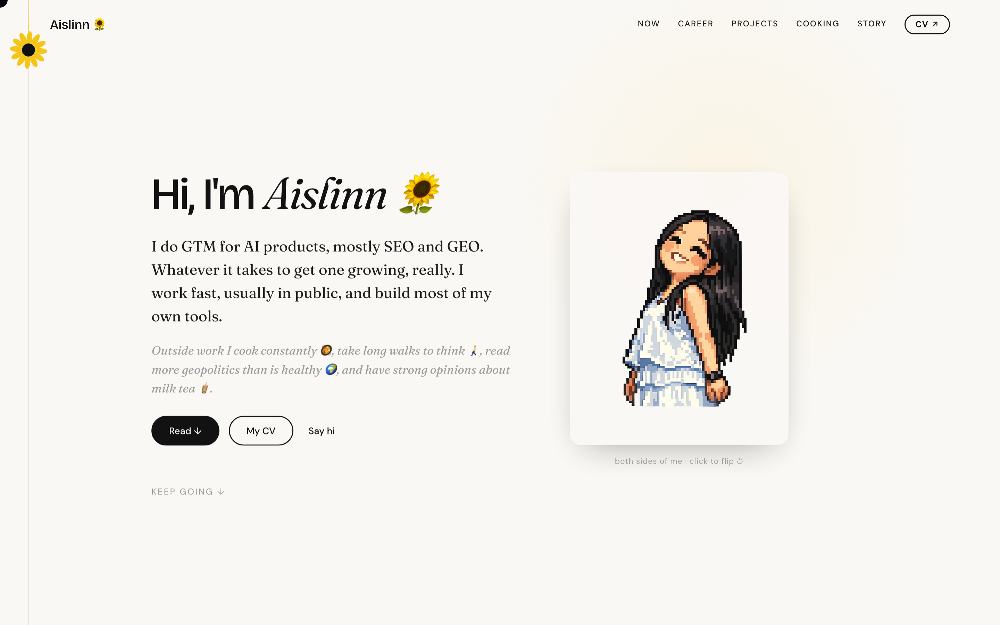

<div align="center">

# 🌻 aislinnyang.com

**I do growth for AI products. This is my personal site and the tools I use every day, open-sourced.**

[](https://aislinnyang.com)
[](https://claude.com/claude-code)
[](LICENSE)

[中文](README.md) · English

<a href="https://aislinnyang.com"></a>

</div>

> The site isn't an achievement showcase. It tries to answer one question: **what is this person actually like, in real life and at work?** How she thinks, what she's building, what she's overthinking, what kind of life she's trying to build.

I do growth, not product engineering, but I build most of the tools I need myself, vibe-coded with Claude Code. This site (`site/`) is one of them: hand-written HTML / CSS / JS on Cloudflare Pages. The part I actually want to share is `skills/`, the Agent Skills I reach for every day to do growth.

## Layout

```
aislinnyang/
├── site/       # aislinnyang.com source (static site, Cloudflare Pages)
│   ├── index.html      home
│   ├── about.html      about
│   ├── cooking.html    /cooking · an editorial photo grid of my cooking
│   ├── welcome.html    first-visit onboarding
│   ├── script.js / style.css
│   ├── assets/         images, fonts, PDF résumés, etc.
│   └── CLAUDE.md       Claude Code context for the site (voice, tone, rules)
└── skills/     # Agent Skills collection (work in progress)
```

## Run the site locally

`site/` is a plain static site, so any static server works:

```bash
cd site
python3 -m http.server 8000
# open http://localhost:8000
```

Deployment is on Cloudflare (`site/wrangler.jsonc`).

## Skills

`skills/` collects the Agent Skills I use every day, following the [Agent Skills open standard](https://docs.claude.com/en/docs/claude-code/skills) so they load directly in Claude Code and other agents. Still being tidied up, see [`skills/README.md`](skills/README.md).

## License

[MIT](LICENSE) · free to use / modify / redistribute. The writing, photos, and personal content on the site are mine; the code and structure are yours to learn from.

---

<div align="center">

By [**Yixin Yang (Aislinn)**](https://aislinnyang.com) · growth for AI products · going global · occasionally vibe-coding 🌻

</div>
